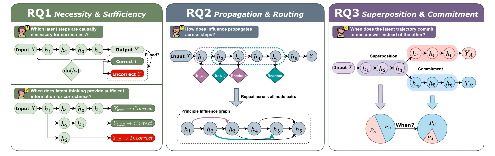

# Dynamics Within Latent Chain-of-Thought: An Empirical Study of Causal Structure


<p align="center">
  <a href="https://arxiv.org/abs/2602.08783"></a>
  <a href="LICENSE"></a>
</p>

This repository contains the code, experiment configurations, preprocessing utilities, and plotting scripts for the paper:

`Dynamics Within Latent Chain-of-Thought: An Empirical Study of Causal Structure`


## Latest Updates

- Feb 09, 2026: The paper was released on arXiv: [Dynamics Within Latent Chain-of-Thought: An Empirical Study of Causal Structure](https://arxiv.org/abs/2602.08783).
- Mar 01, 2026: The paper was accepted to the ICLR 2026 workshop [Latent & Implicit Thinking - Going Beyond CoT Reasoning](https://latent-implicit-thinking.github.io/). OpenReview discussion: [9rBJRME17M](https://openreview.net/forum?id=9rBJRME17M#discussion).
- Mar 12, 2026: Our Github repo is online!

## Repository Structure

- `common/`: shared model wrappers, registries, metrics, and experiment utilities
- `configs/`: experiment configurations grouped by research question
- `experiments/`: Python entry points for the main experiments
- `scripts/`: shell wrappers for running experiments
- `r-script/`: R scripts for figure generation
- `data/`: lightweight local preprocessing scripts and processed JSONL inputs

The repository intentionally excludes publication-unfriendly dependencies such as local checkpoints, large generated outputs, and machine-specific paths from the tracked public workflow.

The codebase is organized around three research questions:

- `RQ1`: step ablation and sufficiency analyses
- `RQ2`: latent and explicit causal graph analyses
- `RQ3`: superposition, projection, and intervention analyses

## Naming Conventions

- Configs: `configs/rq{n}/{method}/{model}-{dataset}.yaml`
- Experiment entry points: `experiments/rq{n}/run_<task>.py`
- Shell wrappers: `scripts/rq{n}/{subtask}/run_<task>_<model>_<dataset>.sh`
- Plot scripts: `scripts/plot/{python|r}/rq{n}/...`
- Outputs: `outputs/rq{n}/{artifact_type}/...`

Tracked configs use portable path placeholders:

- `${PROJECT_ROOT}`
- `${MODEL_DIR}`
- `${DATA_DIR}`
- `${OUTPUT_DIR}`

These placeholders are expanded automatically by the Python config loader.

## Setup

### 1. Clone the repository

```bash
git clone <repo-url>
cd latentCoT
```

### 2. Create a Python environment

A minimal setup is:

```bash
conda create -n latentcot python=3.10
conda activate latentcot
pip install torch transformers datasets pandas numpy tqdm pyyaml
```

You may need to install additional dependencies depending on which model family or plotting pipeline you run.

### 3. Configure local paths

If your local layout differs from the defaults, set:

```bash
export PROJECT_ROOT=/path/to/latentCoT
export MODEL_DIR=/path/to/local/models
export R_ENV_NAME=latentcot-r
```

Defaults:

- `PROJECT_ROOT` is inferred automatically in shell scripts
- `MODEL_DIR` defaults to `PROJECT_ROOT/models`

### 4. Optional R environment

```bash
bash r-script/setup_r_env.sh
```

## Data

The repository includes local preprocessing utilities and lightweight processed files under `data/`. The experiments in this project use datasets such as:

- CommonsenseQA
- GSM8K / GSM8K-Aug
- ProntoQA
- StrategyQA
- SVAMP

If you prepare a public artifact, review any contents under `datasets/` separately and ensure redistribution is permitted.

## Running Experiments

Representative commands:

### RQ1

```bash
bash scripts/rq1/ablation/gsm8k/run_coconut_ablation_gpt2_gsm8k.sh
bash scripts/rq1/sufficiency/commonsenseqa/run_coconut_llama1b_sufficiency_commonsenseqa.sh
```

### RQ2

```bash
bash scripts/rq2/explicit/run_explicit_cot_llama1b_commonsenseqa.sh
bash scripts/rq2/latent/run_latent_coconut_gpt2_gsm8k.sh
```

### RQ3

```bash
bash scripts/rq3/gsm8k/coconut_gpt2/run_stage1_mine_ambiguous_gsm8k.sh
bash scripts/rq3/gsm8k/coconut_gpt2/run_stage5_plot_metrics_gsm8k.sh
```

## Plotting

The repository contains both R-based and Python-based plotting code.

- R plotting scripts: `r-script/`
- Python plotting helpers: `scripts/plot/python/`
- Shell wrappers for figures: `scripts/plot/r/`

Example:

```bash
bash scripts/plot/r/rq2/plot_explicit_graph_grid.sh
```

## Reproducibility Notes

- many experiments depend on local model checkpoints that are not distributed in this repository
- vendored code under `external/` may have its own setup and license requirements

External repositories:

```bash
mkdir -p external
git clone <coconut-repo-url> external/coconut
git clone <codi-repo-url> external/codi
git clone <prontoqa-repo-url> external/prontoqa
```

## License

This repository is released under the Creative Commons Attribution-NonCommercial 4.0 International license. See [LICENSE](LICENSE) for details.

Some vendored components under `external/` may retain their own original licenses and should be checked separately before redistribution.

## Acknowledgments

This project builds on several upstream method implementations and benchmark datasets used in our experiments:

- Coconut
- CODI
- CommonsenseQA
- GSM8K
- ProntoQA
- StrategyQA
- SVAMP

## Contact

For questions about the code, experiments, or reproduction:

- open an issue in this repository for bugs, reproducibility problems, or requests related to the public code release
- contact the paper authors using the email addresses listed in the paper for research questions or collaboration inquiries

## Citation

If you use this repository, please cite the paper:

```bibtex
@misc{li2026dynamicslatentchainofthoughtempirical,
      title={Dynamics Within Latent Chain-of-Thought: An Empirical Study of Causal Structure}, 
      author={Zirui Li and Xuefeng Bai and Kehai Chen and Yizhi Li and Jian Yang and Chenghua Lin and Min Zhang},
      year={2026},
      eprint={2602.08783},
      archivePrefix={arXiv},
      primaryClass={cs.AI},
      url={https://arxiv.org/abs/2602.08783}, 
}
```
